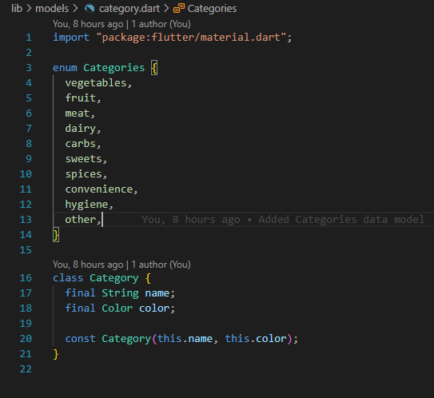
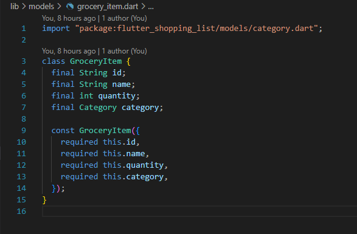
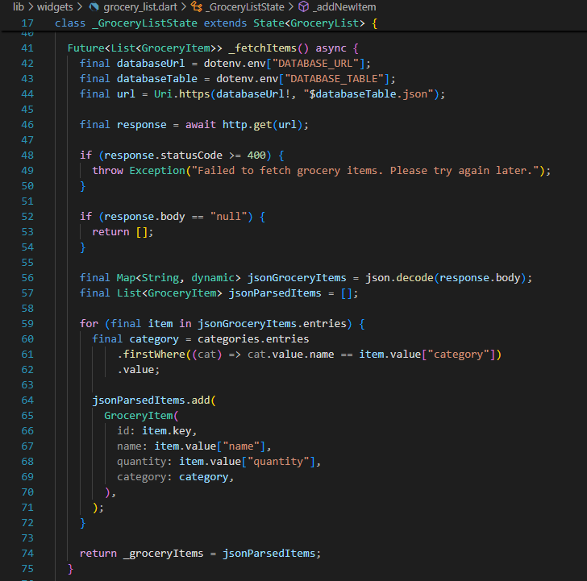
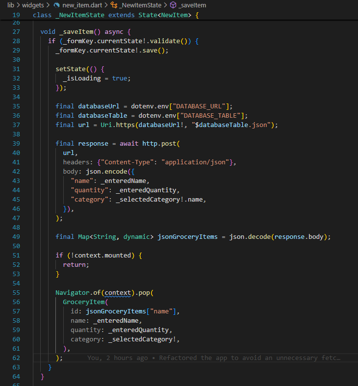
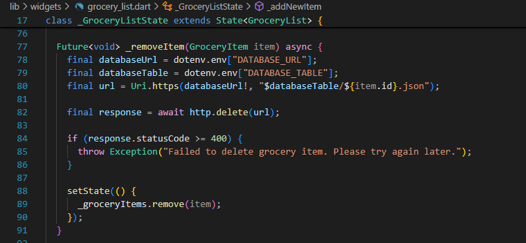
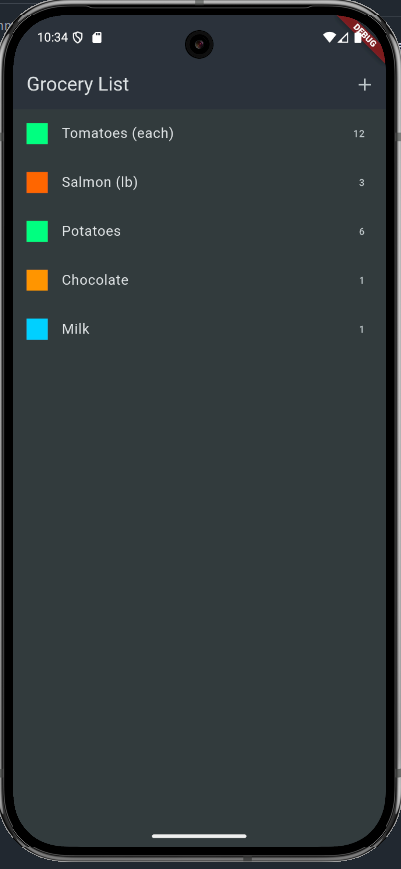
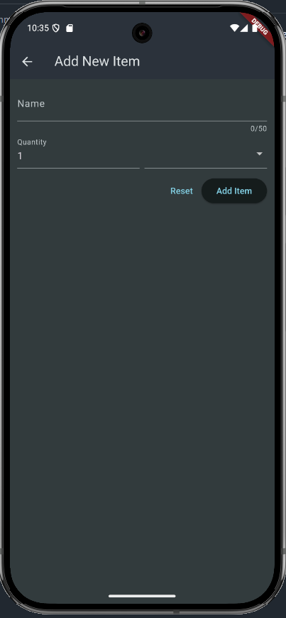

# Flutter Shopping List

## Description

This is a cross-platform shopping list application built with **Flutter** and **Dart**. It demonstrates state management, asynchronous data fetching, and CRUD operations with a remote database. The app allows users to add, view, and remove grocery items, organized by category.

## Features

- Add grocery items to your shopping list
- Categorize items for better organization
- Remove items from the list
- Persist data to a Firebase Realtime Database
- Responsive UI for mobile and desktop
- Environment-based configuration using `.env` file
- Simple and intuitive user interface

## User Stories

```
As a user
I want to add grocery items to my shopping list
So that I can keep track of what I need to buy
```

```
As a user
I want to categorize items
So that my shopping list is organized and easy to use
```

```
As a user
I want to remove items from my list
So that I can manage my shopping efficiently
```

## Design

```
--\lib\models\category.dart:

Defines a category with a name and color for display purposes.
```



```
--\lib\models\grocery_item.dart:

Defines a grocery item with id, name, quantity, and category.
```



```
--\lib\widgets\grocery_list.dart:

Fetches the grocery list from the backend database.
```



```
--\lib\widgets\new_item.dart:

Saves the grocery item to the backend database.
```



```
--\lib\widgets\grocery_list.dart:

Removes a grocery item from the backend database.
```



## Main Screens

```

Main screen. Displays the list of grocery items, allows adding and removing items.
```



```

Screen for adding a new grocery item to the list.
```



## Installation Instructions

1. Install [Flutter SDK](https://docs.flutter.dev/get-started/install) and set up your environment.
2. Clone this repository:
   ```bash
   git clone https://github.com/japinell/flutter_shopping_list.git
   ```
3. Install dependencies:
   ```bash
   flutter pub get
   ```
4. (Optional) Set up a `.env` file for your database configuration.
5. Run the app:
   ```bash
   flutter run
   ```

## Configuration

### Firebase Setup

To use Firebase as your backend database:

1. Go to [Firebase Console](https://console.firebase.google.com/) and create a new project.
2. In the project dashboard, select "Realtime Database" from the left menu and click "Create Database".
3. Choose a location and set the database rules to public for testing (not recommended for production):
   ```json
   {
     "rules": {
       ".read": true,
       ".write": true
     }
   }
   ```
4. Copy your database URL from the Realtime Database section (it looks like `https://your-project-id.firebaseio.com`).
5. In your project root, create a `.env` file and add:
   ```
   DATABASE_URL=your-project-id.firebaseio.com
   DATABASE_TABLE=your-table-name
   ```
   Replace `your-table-name` with the node you want to use for storing grocery items (e.g., `grocery-items`).

This configuration is required for remote data storage and retrieval.

## Packages Used

- **http**: For making REST API calls to the backend database.
- **flutter_dotenv**: For managing environment variables securely.
- **provider**: For state management (if used in your codebase).

### Packages Used

## License

This project is licensed under The MIT License. Refer to https://opensource.org/licenses/MIT for more information.

## Contributing Guidelines

Want to contribute? Clone or fork the project on GitHub. See the license information above.

[](https://opensource.org/licenses/MIT)
